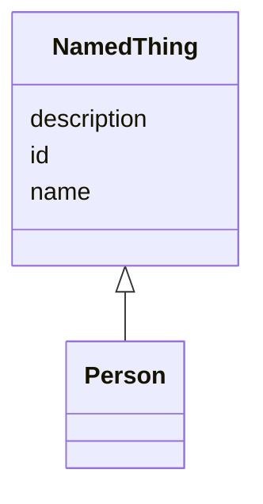

---
search:
  boost: 10.0
---

# Class: NamedThing 


_A generic grouping for any identifiable entity_


<div data-search-exclude markdown="1">


URI: [schema:Thing](http://schema.org/Thing)





## Inheritance
* **NamedThing**
    * [Person](Person.md)


## Class Properties

| Property | Value |
| --- | --- |
| Class URI | [schema:Thing](http://schema.org/Thing) |


## Slots

| Name | Cardinality and Range | Description | Inheritance |
| ---  | --- | --- | --- |
| [id](id.md) | 1 <br/> [Uriorcurie](Uriorcurie.md) | A unique identifier for a thing | direct |
| [name](name.md) | 0..1 <br/> [String](String.md) | A human-readable name for a thing | direct |
| [description](description.md) | 0..1 <br/> [String](String.md) | A human-readable description for a thing | direct |


## Identifier and Mapping Information


### Schema Source


* from schema: https://w3id.org/TerraneXus/ofp-datamodel


## Mappings

| Mapping Type | Mapped Value |
| ---  | ---  |
| self | schema:Thing |
| native | ofp_datamodel:NamedThing |


## LinkML Source

<!-- TODO: investigate https://stackoverflow.com/questions/37606292/how-to-create-tabbed-code-blocks-in-mkdocs-or-sphinx -->

### Direct

<details>
```yaml
name: NamedThing
description: A generic grouping for any identifiable entity
from_schema: https://w3id.org/TerraneXus/ofp-datamodel
slots:
- id
- name
- description
class_uri: schema:Thing

```
</details>

### Induced

<details>
```yaml
name: NamedThing
description: A generic grouping for any identifiable entity
from_schema: https://w3id.org/TerraneXus/ofp-datamodel
attributes:
  id:
    name: id
    description: A unique identifier for a thing
    from_schema: https://w3id.org/TerraneXus/ofp-datamodel
    rank: 1000
    slot_uri: schema:identifier
    identifier: true
    owner: NamedThing
    domain_of:
    - NamedThing
    range: uriorcurie
    required: true
  name:
    name: name
    description: A human-readable name for a thing
    from_schema: https://w3id.org/TerraneXus/ofp-datamodel
    rank: 1000
    slot_uri: schema:name
    owner: NamedThing
    domain_of:
    - NamedThing
    range: string
  description:
    name: description
    description: A human-readable description for a thing
    from_schema: https://w3id.org/TerraneXus/ofp-datamodel
    rank: 1000
    slot_uri: schema:description
    owner: NamedThing
    domain_of:
    - NamedThing
    range: string
class_uri: schema:Thing

```
</details></div>