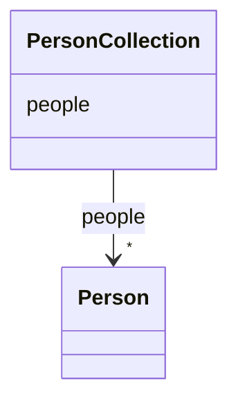

---
search:
  boost: 10.0
---

# Class: PersonCollection 


_A holder for Person objects_


<div data-search-exclude markdown="1">


URI: [ofp_datamodel:PersonCollection](https://w3id.org/TerraneXus/ofp-datamodel/PersonCollection)





<!-- no inheritance hierarchy -->

## Class Properties

| Property | Value |
| --- | --- |
| Tree Root | Yes |


## Slots

| Name | Cardinality and Range | Description | Inheritance |
| ---  | --- | --- | --- |
| [people](people.md) | * <br/> [Person](Person.md) |  | direct |


## Identifier and Mapping Information


### Schema Source


* from schema: https://w3id.org/TerraneXus/ofp-datamodel


## Mappings

| Mapping Type | Mapped Value |
| ---  | ---  |
| self | ofp_datamodel:PersonCollection |
| native | ofp_datamodel:PersonCollection |


## LinkML Source

<!-- TODO: investigate https://stackoverflow.com/questions/37606292/how-to-create-tabbed-code-blocks-in-mkdocs-or-sphinx -->

### Direct

<details>
```yaml
name: PersonCollection
description: A holder for Person objects
from_schema: https://w3id.org/TerraneXus/ofp-datamodel
attributes:
  people:
    name: people
    from_schema: https://w3id.org/TerraneXus/ofp-datamodel
    rank: 1000
    domain_of:
    - PersonCollection
    range: Person
    multivalued: true
    inlined_as_list: true
tree_root: true

```
</details>

### Induced

<details>
```yaml
name: PersonCollection
description: A holder for Person objects
from_schema: https://w3id.org/TerraneXus/ofp-datamodel
attributes:
  people:
    name: people
    from_schema: https://w3id.org/TerraneXus/ofp-datamodel
    rank: 1000
    owner: PersonCollection
    domain_of:
    - PersonCollection
    range: Person
    multivalued: true
    inlined: true
    inlined_as_list: true
tree_root: true

```
</details></div>